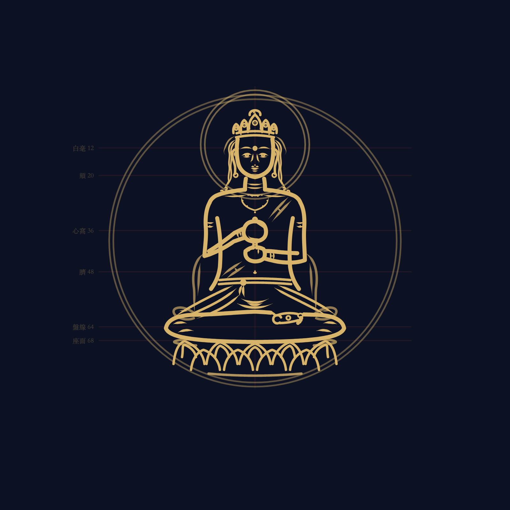
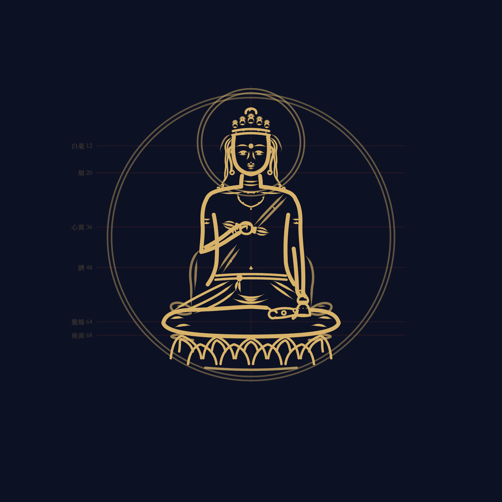
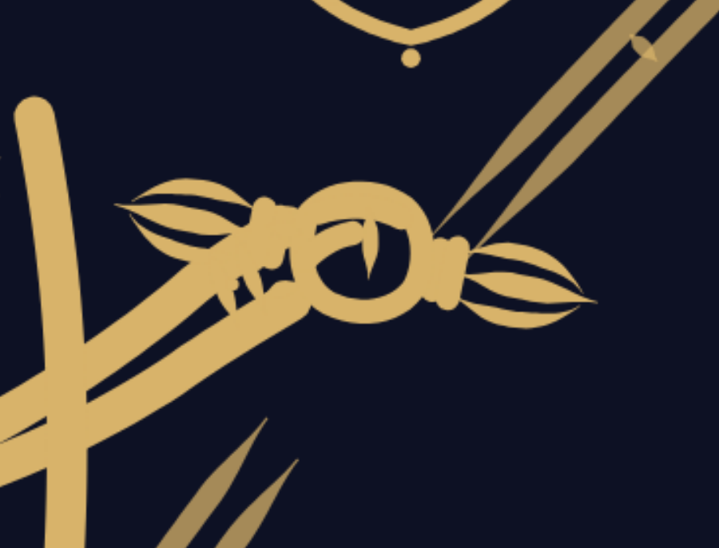
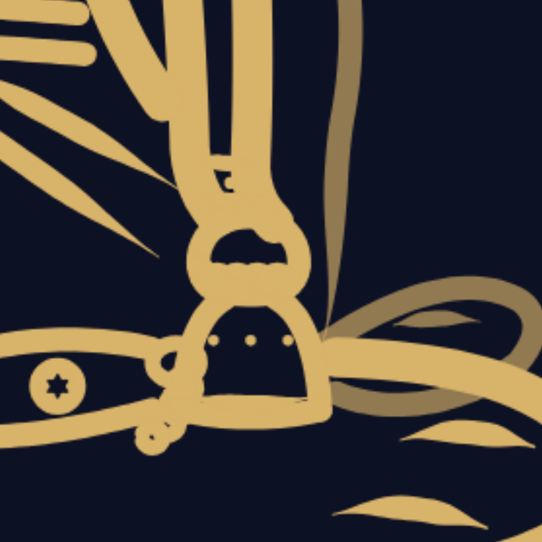

# 圖錄 · 逐尊機出之圖

> 此夾諸圖皆**本庫代碼機出**（`node tools/圖錄.cjs`，隨源可再生），視同 `dist/` 產物，
> 不犯零圖片之律（造像標準七章之注）。每尊一夾：全身（帶量度錨線）＋局部（印・持物・開臉）。

## 畫風之判（本庫之筆，何所從來）

| 維度 | 制 | 所本 |
|---|---|---|
| 畫種 | **程序白描**——非圖片，一切線由代碼生成 | 粉本之本義：刺孔扑粉，形隨本轉 |
| 線 | **鐵線描**為基，筆鋒起收有法（起藏／尖，收回／出），三等筆寬（骨0.60・衣0.36・細0.24） | 造像標準九章（`bi.ts 一筆()`） |
| 量度 | 畫像**百二十指**制格網，坐像 68 指；全身圖上淡硃錨線即其印記 | 《造像量度經解》T1419（`liangdu.ts`，載入誦戒） |
| 法脈 | **現圖為正，五部心觀為證**；経軌図樣（獅子座・象座等）記入異說不強合 | 方針三裁（2026-07-03 印可） |
| 色 | 白描為本；陳列以**紺紙金泥**（紺 `#0d1124`・金 `#d8b36a`），身色兩軌記於儀軌不施於圖 | 身色＝白描為本＋可選薄彩層（已印可） |
| 部件 | 面・座・光・嚴・手・持物皆出**粉本部件庫**（`src/bujian/`），逐件繫出典，精度復利 | 造像標準 9.3 |
| 信級 | 候筆（虛輪）→ **候審**（朱界，候主人印可）→ **已核**（鈐印上壇） | 寧缺毋誤之律 |

## 尊目

| 尊 | 側 | 位 | 印・持物 | 信 | 圖 | 筆（代碼） | 儀軌 |
|---|---|---|---|---|---|---|---|
| 大日如來 | 金剛界 | 成身會中尊 | 智拳印 | **已核** | [全身](center-k/全身.png) · [印](center-k/局部-智拳印.png) · [面](center-k/局部-開臉.png) | [`center-k.ts`](../src/zun/center-k.ts) | [`yigui.ts`](../src/yigui.ts)（center 條） |
| 金剛薩埵 | 金剛界 | 阿閦四親近第一（西） | 執杵鈴（右杵當胸・左鈴安膝） | **候審** | [全身](fugen-k/全身.png) · [杵](fugen-k/局部-執杵.png) · [鈴](fugen-k/局部-執鈴.png) · [面](fugen-k/局部-開臉.png) | [`fugen-k.ts`](../src/zun/fugen-k.ts) | [`yigui.ts`](../src/yigui.ts)（fugen 條） |

## 逐尊小記

### 大日如來 · center-k（已核）

菩薩形（重繪第一刀：非衲衣佛），五智寶冠（五峰寶板鑲珠，中峰最高表法界體性智），
智拳印——左拳立頭指（隙間見一節）、右拳握之、尖出拳頂、右拇指覆壓。蓮華座住白月輪。
出典：MANDALA DUALISM・コトバンク・e国宝・五部心觀（詳儀軌條）。
對勘記：與鎌倉図樣（Met 44845 一系）格網儀軌俱合；図樣獅子座五化佛冠乃経軌一系之證，記異說。

| 局部 | |
|---|---|
|  |  |

### 金剛薩埵 · fugen-k（候審）

菩薩形，**五化佛冠**（五小坐佛各具頭光，依日本大百科「五仏宝冠」，與大日寶板異制），
右手斜執五鈷杵當胸、左手執五鈷鈴安於左膝（鈴位三說並陳：腰脇／膝／左股）。
蓮華座（阿閦月輪西位）。出典四源：日本大百科・祈りの刻跡・SAT図像抄 p.1053・Met図樣（詳儀軌條）。
部件復利之驗：面座光嚴髮皆取粉本，六輪即成（大日曾十二輪）。

| 局部 | | |
|---|---|---|
|  |  |  |

---

陳列頁（互動版，含出典全文）：倉根 `python3 -m http.server` 開 `index.html`。
工作日誌：[docs/札記/落筆第一尊.md](../docs/札記/落筆第一尊.md)。
